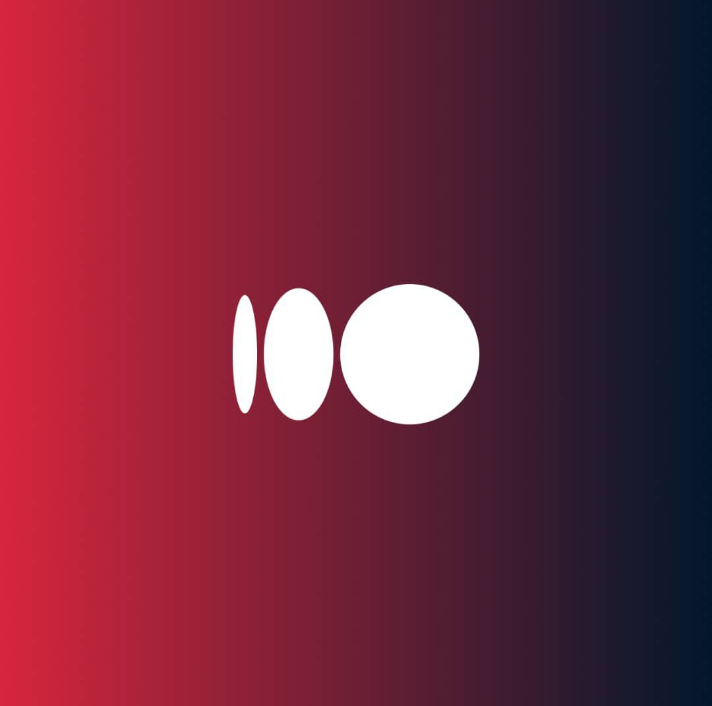

#  ByteWave | Premium Software Development Collective

[](./documentation.md)

ByteWave is a production-ready, high-performance portfolio application built with Next.js 16.1 and JavaScript (JSX). This repository represents the digital identity of **ByteWave**, a global software development team specialized in fast, accessible, and high-quality web and mobile application development.

## 🌊 About ByteWave

ByteWave is more than just a development team; we are a collective of elite engineers and designers dedicated to bridging the gap between high-end software engineering and business affordability. 

Our team operates with a **corporate, polished, and modern** ethos. We don't just "build apps"—we engineer long-term digital solutions that scale. ByteWave specializes in:
- **Scalable Web Applications**: Using modern stacks like Next.js 16 and React 19.
- **High-Performance Mobile Apps**: Delivering seamless cross-platform experiences.
- **Quality Engineering**: Rigorous testing and robust architecture are at the core of every line of code we write.

We cater to startups, founders, and established businesses globally, maintaining a confident and professional tone that reflects our commitment to excellence.

## 🚀 Project Overview

This application serves as the primary landing page and service showcase for ByteWave. It projects our core message: **Fast, Accessible, Long-term, and Affordable.**

### Brand Purpose
ByteWave exists to provide elite-level engineering that is accessible. We focus on long-term sustainability for our clients, ensuring that the digital products we build today are ready for the challenges of tomorrow.

## 🛠 Tech Stack

- **Framework:** [Next.js 16.1 (App Router)](https://nextjs.org/)
- **Language:** JavaScript (JSX)
- **Library:** [React 19](https://react.dev/)
- **Styling:** [Tailwind CSS](https://tailwindcss.com/)
- **Animations:** [Framer Motion](https://www.framer.com/motion/)
- **Icons:** [Lucide React](https://lucide.dev/)

## 📂 Folder Structure

```text
src/
├── app/              # Next.js App Router (Pages, Layouts, Metadata)
├── components/       # Reusable UI Components
│   ├── layout/       # Global components (Navbar, Footer)
│   ├── sections/     # Modular landing page sections
│   └── ui/           # Generic atoms/molecules
└── public/           # Static assets (Logos, Favicon, Brand Images)
```

## 🏃 Local Development

1. **Clone the repository:**
   ```bash
   git clone https://github.com/Bytewaveteam/Portfolio_ByteWave.git
   cd Portfolio_ByteWave
   ```

2. **Install dependencies:**
   ```bash
   npm install
   ```

3. **Run the development server:**
   ```bash
   npm run dev
   ```


**ByteWave** | *Engineering Excellence, Delivered.*
Email: [bytewaveteams@gmail.com](mailto:bytewaveteams@gmail.com)
GitHub: [Bytewaveteam](https://github.com/Bytewaveteam)
